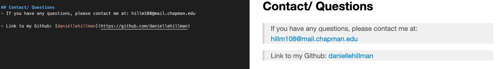

# ReadMe Generator

Created by me: *Danielle Hillman*

## This application produces a ReadMe

Using user input, the command line intakes the follow: Project Title, Description, Usage, Installation, License, Contributing, Tests, and Questions. A series of questions are asking through an inquirer array.

### Output

Taking the user's info, the application utilizes writeFile() to create a formatted ReadMe with their information. 

### Contact

At the end of the application, there is a section that links the user GitHub and their email for contacting purposing.

## Video
Link to Video: https://drive.google.com/file/d/1JHjrHpax0N_QEA223g075RByKQb-Dnyf/view?usp=sharing

